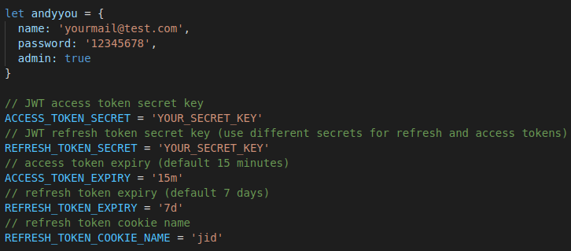

### How to use:  
1. install express, [cors](https://github.com/expressjs/cors#readme)  
2. install [jsonwebtoken](https://www.npmjs.com/package/jsonwebtoken)  
3. modify parameter in src/components/Server/Server.js, such as:  
  
4. modify serverConfig & api_url in src/environment/environment.js  
5. $ cd src/components/Server  
  $ node Server.js  
You can check token in : http://localhost:8080/login  
